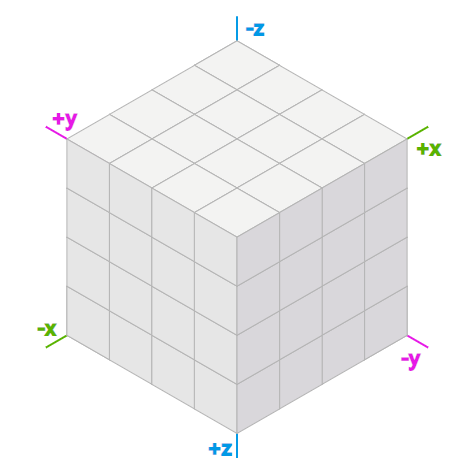

---
这是一个写了很久的项目了。从最开始玩游戏的时候就在思考，做美赛的时候萌生了相关的想法，但是苦于没有时间实现，美赛之后基本写出了代码但是又没有做进一步的整理和迁移。我觉得它非常有趣，也会成为之后的元胞自动机或者其他更多项目的基础和一部分。
---

# 引子

为什么我们要使用正六边形的地图呢?

正六边形格点的距离失真较正方形格点少，这是由于拥有比正方形更多的非对角“邻居”。这个性质在游戏中广泛运用，在三国志曹操传中(上图），使用的是正方形的地图，而在文明5中（下图），使用的是正六边形的地图。

由于曼哈顿距离的定义，对于不同的地图种类，对邻居的定义也不同，对于正方形格点来说，侧斜方比正方向的欧氏距离一样但曼哈顿距离更远，这显然是不够优秀的。

那么为什么不用其他的多边形来做地图呢？这是因为只有正三边形，正四边形和正六边形才能铺满平面，这需要 $2 \pi \ mod\ =  \theta $ ，其中 $\theta$  为正多边形的单个内角角度。

# 实现思路

## 坐标系

一个几何图形由顶点、边和面构成。一个正六边形拥有六个边，六个顶点，每个边被两个正六边形共享，每个顶点被三个正六边形共享。

正六边形的坐标来源于正方体的体对角线的切平面。所以拥有三个轴 $x-y-z$，但是这三个坐标的方向并不是正交的，所以使用其中任意两个坐标即可描述位置。

可以认为正六边形来源于一个正方体的按照如上摆列所形成的透视图.

这样就得到了一个尖顶的正六边形, 为了后续方便计算, 我们将正六边形中心旋转 $30^{\circ0}$, 得到平顶的正六边形.

如上图, 可知其坐标定义及三个坐标轴的排布.

